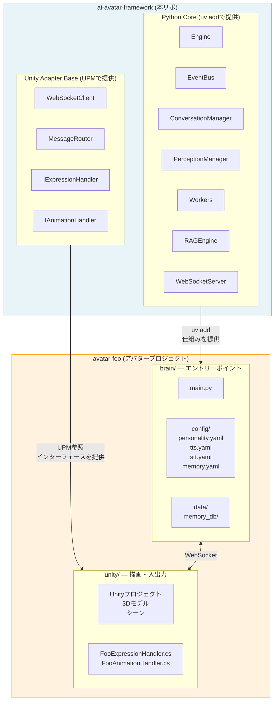

# AI Avatar Framework - アーキテクチャ設計

## 概要

リアルタイム会話AIアバターのためのフレームワーク。
本フレームワークはライブラリとして機能を提供し、アバタープロジェクトから呼び出されて動作する。

## 設計原則

1. **コアとプラットフォームの分離** - 脳（AIロジック）と身体（描画/駆動）をWebSocketで接続
2. **メカニズムとデータの分離** - フレームワークは仕組みを提供、アバターが設定とデータを保持
3. **プラットフォーム非依存** - Unity / ROS2 等、アダプター層の差し替えでプラットフォーム対応
4. **エントリーポイントはアバター側** - フレームワーク自体は起動しない。アバターが起動し、フレームワークを呼び出す

## システム全体像



## Python Core コンポーネント

### Engine

フレームワークの中心。設定を読み込み、各Workerを起動し、WebSocketサーバーを立ち上げる。

```python
# アバター側での利用イメージ
from ai_avatar import Engine

engine = Engine(config_dir="./config", data_dir="./data")
engine.run()
```

### EventBus

コンポーネント間の非同期イベント配信。asyncioベース。

主要イベント:
- `audio.input` - 音声入力データ受信
- `vad.speech_start` / `vad.speech_end` / `vad.pause` - 音声区間検出
- `stt.partial` / `stt.clause` / `stt.final` - 音声認識結果
- `llm.response_chunk` / `llm.response_done` - LLM応答（ストリーミング）
- `llm.expression` / `llm.animation` - 表情・アニメーション指示
- `tts.audio_chunk` - 音声合成結果
- `perception.update` / `perception.trigger` - 知覚情報
- `turn.interrupt` / `turn.cancel` / `tts.stop` - 割り込み制御
- `memory.context` - RAG検索結果

### ConversationManager

会話の状態管理とイベント優先度判断を専任するコンポーネント。
会話状態マシン（IDLE / LISTENING / PROCESSING / SPEAKING / INTERRUPTED）を管理し、
割り込み制御やイベント優先度に基づく判断を行う。
詳細は `llm-conversation-design.md` を参照。

### PerceptionManager

全センサー（視覚・触覚・距離等）の最新状態を集約・保持するコンポーネント。
各センサーWorkerが `perception.update` で知覚を登録し、LLMWorkerがコンテキスト構築時に `get_snapshot()` で最新状態を取得する（push/pull非対称パターン）。
新しいセンサー追加時にLLMWorkerの修正が不要な拡張性を持つ。
詳細は `llm-conversation-design.md` を参照。

### Workers

各機能を担う非同期ワーカー。全Workerは同一プロセス内のasyncioタスクとして動作する。

| Worker | 種別 | 役割 |
|--------|------|------|
| ListenerWorker | Permanent | 常時音声ストリーミング受信、VAD（発話開始/終了/pause検出） |
| STTWorker | Permanent | 音声→テキスト変換（STTアダプター経由、partial/clause/final発行） |
| LLMWorker | Permanent | LLM呼び出し（ストリーミング応答）+ リアクション判定 |
| TTSWorker | Permanent | テキスト→音声変換 |
| VisionWorker | Permanent | カメラ映像→環境認識（PerceptionManagerに登録） |
| MemoryWorker | Permanent | RAG検索・保存 |

### RAGEngine

記憶機能の仕組みを提供。

- Embedding生成
- ベクトル検索（ChromaDB等）
- チャンク分割
- 検索結果のLLMコンテキスト注入

データ実体（DB、ナレッジ文書）はアバター側が保持。

### WebSocketServer

Unity/ROS2アダプターとの通信層。JSONメッセージでやり取り。

## Unity Adapter Base

UPMパッケージとして提供。アバターのUnityプロジェクトから参照される。

### 提供するもの

- **WebSocketClient** - Python Coreとの接続管理
- **MessageRouter** - 受信メッセージの振り分け
- **インターフェース定義**
  - `IExpressionHandler` - 表情制御
  - `IAnimationHandler` - アニメーション制御
  - `IAudioHandler` - 音声入出力
  - `IVisionProvider` - カメラ映像送信

アバター側が各インターフェースを3Dモデルに合わせて実装する。

## リアルタイム応答フロー

イベント駆動 + パイプライン並列化方式を採用。固定間隔ポーリングではなく、
意味のある区切り（節区切り）をトリガーとする。詳細は `llm-conversation-design.md` を参照。

```
音声入力(常時ストリーミング)
    │
    ▼
VAD(音声区間検出)
    ├─ 発話中 + 節区切り検出 → STTが stt.clause 発行
    │                         → MemoryWorkerがRAG先行検索（パイプライン並列化）
    │                         → リアクション判定（相槌・表情、LLM APIは叩かない）
    │
    ├─ 短い間(pause)          → vad.pause発行（節区切り検出の補助）
    │
    └─ 発話終了               → stt.final発行
                               → LLMに完全テキスト送信（RAG結果は先行検索済み）
                               → LLMがストリーミング応答開始
                               → TTS逐次変換 → 音声出力開始
                               → 同時に表情・アニメーション指示送信

割り込み（アバター発話中にユーザーが話し始めた場合）:
    → 300ms猶予後に中断確定
    → LLM/TTS停止 → LISTENING状態に遷移
```

## 提供形態

| コンポーネント | 提供方法 | 利用方法 |
|-------------|---------|---------|
| Python Core | uv add | `from ai_avatar import Engine` |
| Unity Adapter Base | UPM (git URL) | Packages/manifest.json で参照 |
| ROS2 Adapter | 将来対応 | - |

## アバタープロジェクト側の責務

| 項目 | 内容 |
|------|------|
| 人格定義 | personality.yaml にシステムプロンプト等を記述 |
| 声設定 | tts.yaml にTTSエンジン種別と設定を記述（後述） |
| 音声認識設定 | stt.yaml にSTTエンジン種別と設定を記述（後述） |
| 記憶データ | data/ 配下にRAG DB実体を保持 |
| 3Dモデル | Unityプロジェクト内に配置 |
| 表情実装 | IExpressionHandler を3Dモデルに合わせて実装 |
| アニメーション実装 | IAnimationHandler を3Dモデルに合わせて実装 |
| カスタムスキル | skills/ にPythonスクリプトとして追加 |

## tts.yaml と TTSアダプター

tts.yaml はTTSエンジンの種別と固有設定を記述する。

```yaml
tts:
  engine: "voicevox"          # TTSエンジン種別

  voicevox:
    host: "localhost"
    port: 50021
    speaker_id: 3
    speed_scale: 1.0
    pitch_scale: 0.0

  google:
    language_code: "ja-JP"
    voice_name: "ja-JP-Neural2-B"
    speaking_rate: 1.0
```

### TTSアダプター設計

TTSエンジンごとに能力（感情パラメータ、音素情報の有無等）が大きく異なるため、
共通インターフェースは最小限（テキスト→音声バイナリ）とし、エンジン固有の設定はYAML側に閉じ込める。

```
TTSWorker
  └── TTSAdapter (共通インターフェース: text → audio bytes)
        ├── VoicevoxAdapter
        ├── GoogleTTSAdapter
        └── ...（将来追加）
```

エンジン選択は `tts.yaml` の `tts.engine` 値で決定される。

## stt.yaml と STTアダプター

stt.yaml はSTTエンジンの種別と固有設定を記述する。

```yaml
stt:
  engine: "whisper"

  whisper:
    model: "large-v3"
    language: "ja"
    api_url: "http://localhost:9000"

  google:
    language_code: "ja-JP"
    model: "latest_long"
```

### STTアダプター設計

STTエンジンには一括変換型（Whisper）とストリーミング型（Google STT等）があり、
VADの責務やstt.partialの可否が異なる。この差異はSTTAdapter内部で吸収する。

ListenerWorkerは常に音声チャンクをSTTWorkerに送るだけとし、
バッファリング・VAD・API呼び出しの違いはアダプター内部に閉じ込める。

```
ListenerWorker (音声チャンクを送るだけ)
    │
    ▼
STTWorker
  └── STTAdapter (共通インターフェース: audio chunk → callback(text, is_final))
        ├── WhisperAdapter ─── 内部でバッファリング+VAD → 発話区間を一括変換
        │                       stt.partial は発行しない
        └── GoogleSTTAdapter ── チャンクをそのままStreaming APIに転送
                                stt.partial / stt.final をリアルタイム発行
```

| エンジン種別 | VAD | stt.partial | stt.final |
|------------|-----|-------------|-----------|
| 一括型（Whisper） | アダプター内部で実行 | 非対応 | 発話区間ごとに発行 |
| ストリーミング型（Google等） | API側で処理 | リアルタイム発行 | リアルタイム発行 |

エンジン選択は `stt.yaml` の `stt.engine` 値で決定される。
