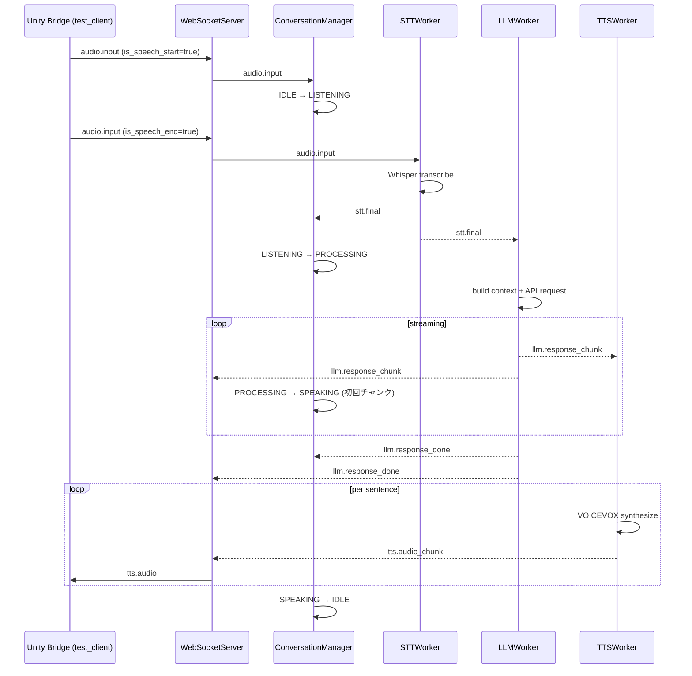

# クラス図（最小構成実装）

実装済みコンポーネントのクラス構成。

```mermaid
classDiagram

    %% ── Engine ──────────────────────────────────────────────────

    class Engine {
        -config_dir: Path
        -data_dir: Path
        -_config: Config
        -_bus: EventBus
        -_cm: ConversationManager
        -_ws_server: WebSocketServer
        -_workers: list
        +run() None
        -_startup() None
        -_shutdown() None
        -_build_stt_worker() STTWorker
        -_build_llm_worker() LLMWorker
        -_build_tts_worker() TTSWorker
    }

    %% ── EventBus ─────────────────────────────────────────────────

    class EventBus {
        -_handlers: dict
        +subscribe(event_type, handler) None
        +unsubscribe(event_type, handler) None
        +publish(event_type, data) None
    }

    %% ── Config ───────────────────────────────────────────────────

    class Config {
        -_dir: Path
        -_data: dict
        +get(key, default) Any
    }

    %% ── ConversationManager ──────────────────────────────────────

    class ConversationManager {
        -_bus: EventBus
        -_state: ConversationState
        -_pending_utterance: list[str]
        -_interrupt_task: Task
        +start() None
        +stop() None
        +accumulate_utterance(text) None
        +state: ConversationState
        +pending_utterance: list[str]
        -_on_audio_input(event, data) None
        -_on_stt_final(event, data) None
        -_on_llm_response_chunk(event, data) None
        -_on_llm_response_done(event, data) None
        -_on_tts_stop(event, data) None
        -_schedule_interrupt() None
        -_transition(new_state) None
    }

    class ConversationState {
        <<enumeration>>
        IDLE
        LISTENING
        PROCESSING
        SPEAKING
        INTERRUPTED
    }

    %% ── WebSocketServer ──────────────────────────────────────────

    class WebSocketServer {
        -_bus: EventBus
        -_host: str
        -_port: int
        -_connection: ServerConnection
        -_session_id: str
        +start() None
        +stop() None
        -_handle_connection(ws) None
        -_dispatch(raw) None
        -_on_hello(payload) None
        -_on_audio_input(payload) None
        -_send(msg_type, payload) None
    }

    %% ── BaseWorker ───────────────────────────────────────────────

    class BaseWorker {
        <<abstract>>
        #_bus: EventBus
        #_config: dict
        #_status: WorkerStatus
        +start() None
        +stop() None
        +reset() None
        +status: WorkerStatus
        #setup() None
        #teardown() None
        #subscribe(event_type) None
        #_handle(event_type, data) None
        -_set_status(status) None
    }

    class WorkerStatus {
        <<enumeration>>
        READY
        DEGRADED
        DOWN
    }

    %% ── STT ──────────────────────────────────────────────────────

    class STTWorker {
        -_adapter: STTAdapter
        +setup() None
        +teardown() None
        #_handle(event_type, data) None
        -_on_partial(text) None
        -_on_clause(text) None
        -_on_final(text) None
    }

    class STTAdapter {
        <<abstract>>
        +on_partial: Callable
        +on_clause: Callable
        +on_final: Callable
        +setup() None
        +on_audio_chunk(chunk, is_speech_start, is_speech_end, sample_rate) None
        +teardown() None
    }

    class WhisperAdapter {
        -_config: dict
        -_model: WhisperModel
        -_buffer: bytearray
        -_sample_rate: int
        +setup() None
        +on_audio_chunk(chunk, ...) None
        +teardown() None
        -_transcribe() None
    }

    %% ── LLM ──────────────────────────────────────────────────────

    class LLMWorker {
        -_personality: dict
        -_cm: ConversationManager
        -_adapter: LLMAdapter
        -_history: list[dict]
        -_rag_context: str
        -_current_task: Task
        +setup() None
        +teardown() None
        #_handle(event_type, data) None
        -_respond(user_text) None
        -_on_chunk(text) None
        -_build_system_prompt() str
        -_build_messages(current_input) list
    }

    class LLMAdapter {
        <<abstract>>
        +setup() None
        +stream_reply(system_prompt, messages, on_chunk) tuple
        +teardown() None
    }

    class AnthropicAdapter {
        -_config: dict
        -_client: AsyncAnthropic
        +setup() None
        +stream_reply(system_prompt, messages, on_chunk) tuple
        +teardown() None
    }

    %% ── TTS ──────────────────────────────────────────────────────

    class TTSWorker {
        -_adapter: TTSAdapter
        -_text_buffer: str
        -_synthesis_queue: Queue
        -_sender_task: Task
        +setup() None
        +teardown() None
        #_handle(event_type, data) None
        -_flush_sentences(final) None
        -_clear() None
        -_sender_loop() None
    }

    class TTSAdapter {
        <<abstract>>
        +setup() None
        +synthesize(text) bytes
        +audio_format() dict
        +teardown() None
    }

    class VoicevoxAdapter {
        -_config: dict
        -_client: AsyncClient
        -_base_url: str
        -_speaker_id: int
        +setup() None
        +synthesize(text) bytes
        +audio_format() dict
        +teardown() None
    }

    %% ── 関係 ─────────────────────────────────────────────────────

    Engine *-- EventBus
    Engine *-- Config
    Engine *-- ConversationManager
    Engine *-- WebSocketServer
    Engine *-- STTWorker
    Engine *-- LLMWorker
    Engine *-- TTSWorker

    ConversationManager --> EventBus : publish/subscribe
    ConversationManager *-- ConversationState

    WebSocketServer --> EventBus : publish/subscribe

    BaseWorker --> EventBus : publish/subscribe
    BaseWorker *-- WorkerStatus

    STTWorker --|> BaseWorker
    STTWorker *-- STTAdapter
    WhisperAdapter --|> STTAdapter

    LLMWorker --|> BaseWorker
    LLMWorker *-- LLMAdapter
    LLMWorker --> ConversationManager : pending_utterance\naccumulate_utterance
    AnthropicAdapter --|> LLMAdapter

    TTSWorker --|> BaseWorker
    TTSWorker *-- TTSAdapter
    VoicevoxAdapter --|> TTSAdapter
```

## イベントフロー（最小構成）

```mermaid
sequenceDiagram
    participant A as Unity Bridge (test_client)
    participant WS as WebSocketServer
    participant CM as ConversationManager
    participant STT as STTWorker
    participant LLM as LLMWorker
    participant TTS as TTSWorker

    A->>WS: audio.input (is_speech_start=true)
    WS->>CM: audio.input
    CM->>CM: IDLE → LISTENING

    A->>WS: audio.input (is_speech_end=true)
    WS->>STT: audio.input
    STT->>STT: Whisper transcribe
    STT-->>CM: stt.final
    STT-->>LLM: stt.final
    CM->>CM: LISTENING → PROCESSING

    LLM->>LLM: build context + API request
    loop streaming
        LLM-->>TTS: llm.response_chunk
        LLM-->>WS: llm.response_chunk
        CM->>CM: PROCESSING → SPEAKING (初回チャンク)
    end
    LLM-->>CM: llm.response_done
    LLM-->>WS: llm.response_done

    loop per sentence
        TTS->>TTS: VOICEVOX synthesize
        TTS-->>WS: tts.audio_chunk
        WS->>A: tts.audio
    end
    CM->>CM: SPEAKING → IDLE
```
