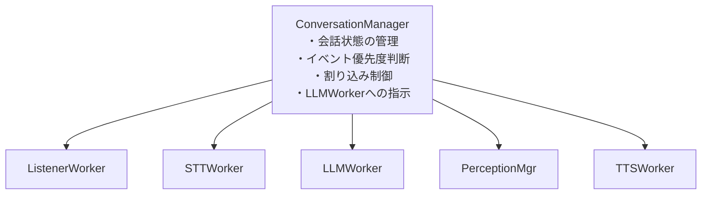
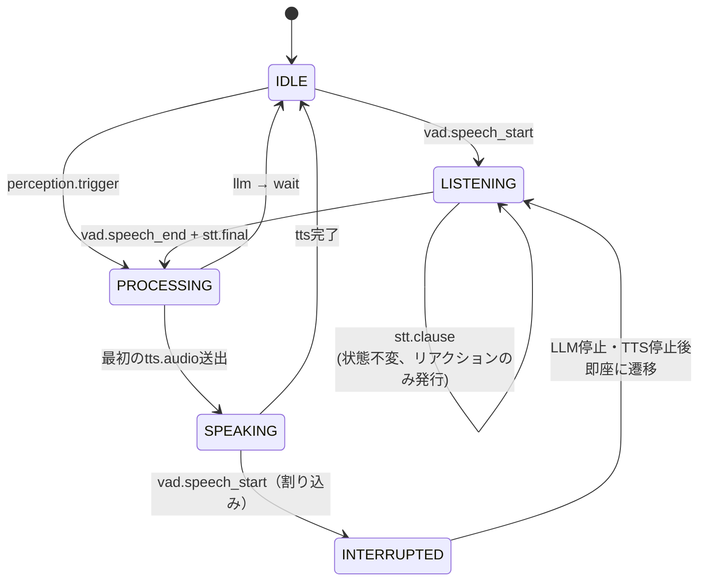
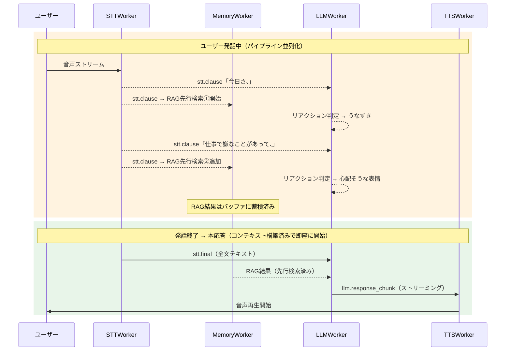
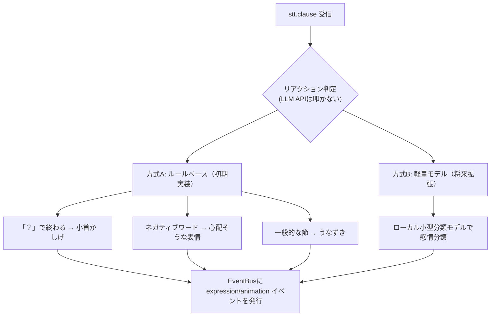
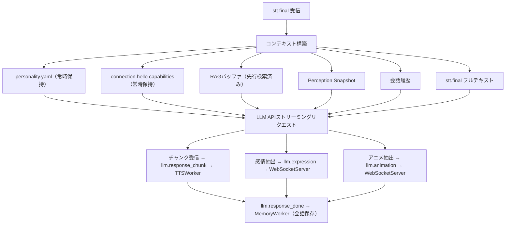
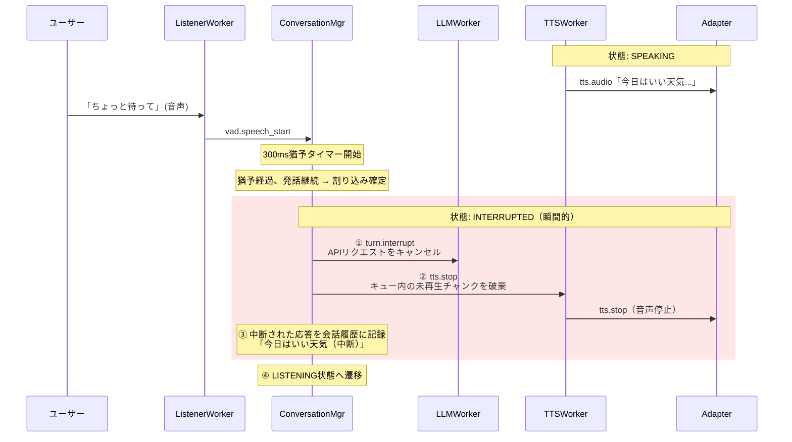
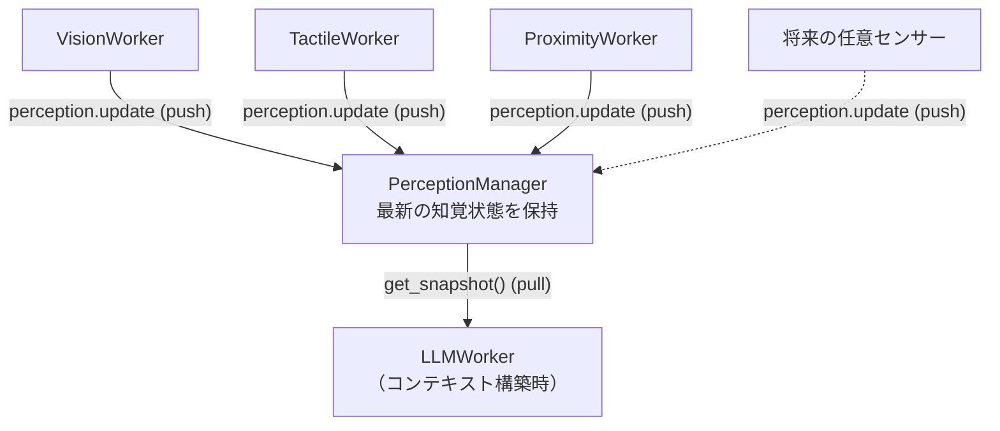
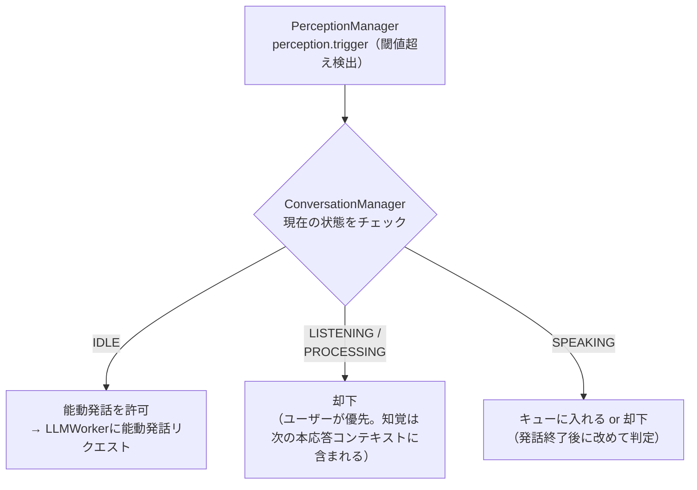
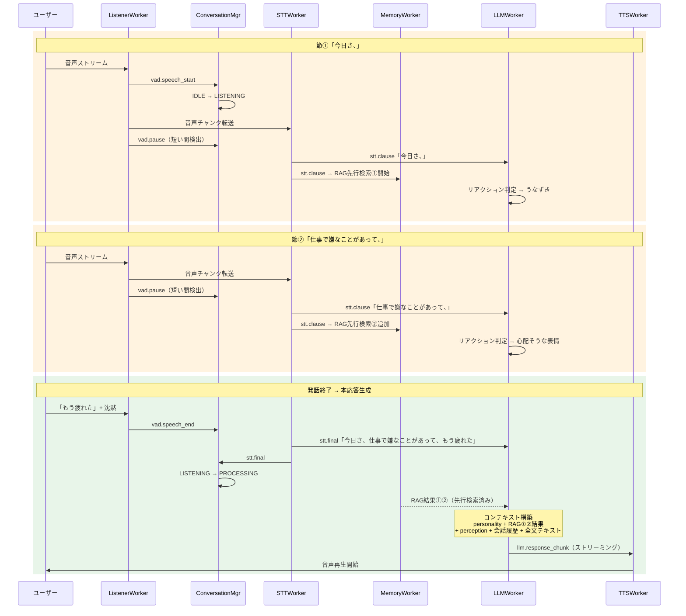

# LLM会話設計 - ターンテイキング・コンテキスト構築

## 概要

本ドキュメントはLLMWorkerを中心とした会話制御の詳細設計を記述する。
モデル非依存の基本ロジック（本ドキュメント）と、採用モデルごとのチューニング（別途）を明確に分離する。

### スコープ

**本ドキュメントの対象（モデル非依存の基本ロジック）:**
- コンテキスト構築戦略
- 会話フロー制御（ターンテイキング）
- 割り込み処理
- 知覚情報の統合
- イベント優先度
- レスポンスパース・バリデーション
- ストリーミング制御
- メモリ管理（会話履歴の保持・圧縮）

**別途定義するもの（モデル依存のチューニング）:**
- プロンプトテンプレートの最適化
- トークン上限・コンテキストウィンドウサイズの具体値
- API固有パラメータ（temperature, top_p, stop sequences等）
- レスポンス形式の強制方法（function calling vs JSON mode vs プロンプト指示）
- ストリーミングチャンクの粒度差異への対応

---

## ConversationManager

会話の状態管理とイベント優先度判断を専任するコンポーネント。
LLMWorkerに全責務を押し込むと肥大化するため、状態管理・優先度判断・割り込み制御を分離する。



### 会話状態マシン



状態一覧:
- `IDLE` - 待機中。誰も話していない
- `LISTENING` - ユーザーが発話中。アバターは聞いている
- `PROCESSING` - ユーザー発話終了、LLMが応答を生成中
- `SPEAKING` - アバターが発話中（TTS再生中）
- `INTERRUPTED` - 一時状態。割り込み検出後、LLM/TTSを停止しLISTENINGへ遷移

---

## ターンテイキング設計

### 設計方針: イベント駆動 + パイプライン並列化

固定間隔ポーリングではなく、**意味のある区切り（節区切り）をトリガーとする**方式を採用する。
固定間隔だと単語途中や不確定なSTT結果でLLMに送ることになり、判断精度が下がり、コストも無駄になる。

### 3つのトリガー層

| トリガー | 検出元 | 目的 | LLMへのリクエスト |
|---------|--------|------|-------------------|
| **節区切り** | STTの中間結果 + 句読点/間検出 | 先行処理の開始、リアクション | なし（ルールベース等で処理） |
| **VAD発話終了** | ListenerWorker | 本応答の生成 | フル（応答生成） |
| **割り込み検出** | ListenerWorker（SPEAKING中） | アバター発話の中断 | キャンセル + 新規リクエスト |

### 節区切り検出

以下のいずれかを節区切りとして検出する（STT/VAD併用を前提、実装時にチューニング）:

- STT中間結果に句読点（。、？！）が出現
- STT中間結果が更新されない期間が300-500ms続いた（短い間）
- STT中間結果のテキスト長が前回送信時から一定量増加

### パイプライン並列化

ユーザーが話している間に応答に必要な準備を並列で進め、体感レイテンシを短縮する。



### リアクション判定（stt.clause時）

stt.clause受信時は**LLM APIを叩かない**。低コスト・低レイテンシでリアクションを返す。



### 本応答生成（stt.final時）



---

## 割り込み処理

### 方式: 猶予付き中断

ユーザー音声検出後、即座に中断するのではなく**300ms の猶予**を設ける。
猶予中にユーザー発話が継続している場合のみ中断を実行する。
これにより咳やノイズによる誤中断を防ぐ。猶予時間は設定可能とする。

### 中断処理フロー



### 割り込み関連イベント

| イベント | 発行元 | 購読先 | 目的 |
|---------|--------|--------|------|
| `turn.interrupt` | ConversationMgr | LLMWorker, TTSWorker | 現在の応答を中断 |
| `turn.cancel` | LLMWorker | TTSWorker | LLM応答ストリームの停止 |
| `tts.stop` | ConversationMgr | TTSWorker, WebSocketServer | 音声再生の即時停止 |

---

## PerceptionManager

全センサーの最新状態を集約・保持するコンポーネント。
各センサーWorkerが直接LLMWorkerにイベントを送る方式ではスケールしないため、
共有状態層を設けてLLMWorkerはコンテキスト構築時に最新状態をpullする。

### 設計パターン



音声パスはイベント駆動（push）、知覚パスは最新状態参照（pull）。この非対称性がポイント。

### インターフェース

```python
class PerceptionManager:
    def update(self, source: str, observation: PerceptionEntry) -> None:
        """各センサーWorkerが呼ぶ。最新の知覚を登録"""

    def get_snapshot(self) -> list[PerceptionEntry]:
        """LLMWorkerがコンテキスト構築時に呼ぶ。全センサーの最新状態を返す"""

    def get_snapshot_by_source(self, source: str) -> PerceptionEntry | None:
        """特定センサーの最新状態のみ取得"""
```

```python
@dataclass
class PerceptionEntry:
    source: str           # "vision", "tactile", ...
    text: str             # LLMコンテキストに注入するテキスト表現
    timestamp: float      # 観測時刻
    priority: int         # コンテキストのトークン配分時の優先度
    ttl: float            # 有効期限（秒）。古い知覚は自動的に無視
```

### TTL（有効期限）

センサーごとに知覚の鮮度が異なる。ttl切れの知覚はget_snapshot()の結果に含まれない。

| センサー | ttl目安 | 理由 |
|---------|---------|------|
| 視覚 | 10-30秒 | シーンは比較的ゆっくり変化 |
| 触覚 | 3-5秒 | 接触は瞬間的、すぐ陳腐化 |
| 距離 | 5-10秒 | 人の移動速度に依存 |
| 温度 | 60秒 | ゆっくり変化 |

### 新しいセンサーの追加手順

1. 新しいWorkerを作る（例: `TactileWorker`）
2. そのWorkerが `perception.update` イベントを発行する
3. 以上。LLMWorkerの修正は不要。

### 知覚がターンを駆動するケース（能動発話）

コンテキスト提供型の知覚でも、閾値を超えた場合にアバター側から能動的に発話を開始するケースがある。

例:
- ユーザーが近づいてきた → 「あ、こんにちは」
- 突然触られた → 「わっ、びっくりした」
- ユーザーが離れていく → 「あれ、行っちゃうの？」



能動発話の制御パラメータ（personality.yaml に設定）:

```yaml
proactive_speech:
  enabled: true
  cooldown_seconds: 30     # 能動発話後、次の能動発話まで最低30秒空ける
  max_per_minute: 2        # 1分間に最大2回まで
  priority_threshold: 3    # この優先度以上の知覚トリガーのみ能動発話を許可
```

---

## イベント優先度

ConversationManagerが判断する優先度体系。

```
優先度1（最高）: ユーザー割り込み
  vad.speech_start（SPEAKING中）
  → 他の全てを中断してでもユーザーの発話を聞く

優先度2: ユーザー通常発話
  stt.final → 本応答生成
  → 知覚トリガーより優先

優先度3: 高優先度の知覚トリガー
  例: 突然触られた、ユーザーが目の前に来た
  → IDLE時のみ能動発話を開始

優先度4: 低優先度の知覚トリガー
  例: 背景の変化、温度変化
  → 能動発話はしない。次の本応答コンテキストに含めるのみ

優先度5（最低）: リアクション
  stt.clause → 相槌・表情
  → いつでも実行可能、他を中断しない
```

---

## コンテキスト構築

### コンテキスト構造

LLMに送信するコンテキストの構成要素と優先度。

```
┌──────────────────────────────────────────┐
│ ① System Prompt (personality.yaml)       │ 固定  ─── 最優先で確保
│    人格定義、応答ルール、JSON形式指示       │
├──────────────────────────────────────────┤
│ ② Adapter Capabilities                   │ 固定  ─── 小さい
│    使用可能な expression / animation 一覧 │
├──────────────────────────────────────────┤
│ ③ Perception Snapshot                    │ 可変  ─── ttl内のもののみ
│    vision / tactile / proximity の現在値  │        priority順にトークン配分
├──────────────────────────────────────────┤
│ ④ RAG Results                            │ 可変  ─── 関連度でフィルタ
│    先行検索済みの記憶                      │
├──────────────────────────────────────────┤
│ ⑤ Conversation History                   │ 可変  ─── 最もトークンを消費
│    直近の会話（古いものから切り詰め）       │        要約圧縮の対象
├──────────────────────────────────────────┤
│ ⑥ Current Input                          │ 可変  ─── 必ず含める
│    stt.final テキスト or 知覚トリガー内容  │
└──────────────────────────────────────────┘
```

### トークン配分の優先度ルール

トークン不足時に下位から削る。具体的なトークン数はモデル依存チューニング側で定義する。

```python
CONTEXT_PRIORITY = [
    # 削れないもの（必ず含める）
    ("system_prompt",        MUST_INCLUDE),
    ("current_input",        MUST_INCLUDE),
    ("adapter_capabilities", MUST_INCLUDE),

    # 削れるもの（トークン不足時に下から削る）
    ("perception_snapshot",  HIGH),    # ttlで自然に量が制限される
    ("rag_results",          MEDIUM),  # 関連度の低いものから削る
    ("conversation_history", LOW),     # 最も柔軟に圧縮可能
]
```

会話履歴の優先度が最も低い理由: 最も量が大きく圧縮の余地があるため。

### 会話履歴の圧縮戦略

```
会話履歴の構造:
┌─────────────────────────────────────┐
│ [要約ブロック]                       │
│ 「ユーザーは仕事の悩みについて話し、   │  ← 古い会話を要約
│  アバターが共感・助言を行った」        │
├─────────────────────────────────────┤
│ [直近Nターン - 生テキスト]            │
│ User: 「もう疲れた」                 │  ← 直近は原文保持
│ Avatar: 「大変だったね（中断）」      │     中断情報も含む
│ User: 「ちょっと待って、電話が...」   │
└─────────────────────────────────────┘
```

要約の生成タイミング:
- 直近Nターンを超えたとき（Nは設定値）
- 会話のトピックが切り替わったとき
- LLMで要約生成するが、本応答とは非同期に実行（MemoryWorkerの責務）

---

## LLMレスポンス

| action | 用途 | トリガー |
|--------|------|---------|
| `respond` | 本応答 | VAD発話終了後のstt.final |
| `wait` | まだ聞いている（応答しない） | VAD発話終了（でもまだ続きそうと判断） |
| `think` | 考え中表示 → 詳細応答 | VAD発話終了（複雑な質問等） |
| `backchannel` | 相槌・表情のみ（新規） | 節区切り時のリアクション判定 |
| `interrupt` | アバターが口を挟む（新規） | 節区切り時（稀なケース） |

---

## Worker間イベントフロー全体像



