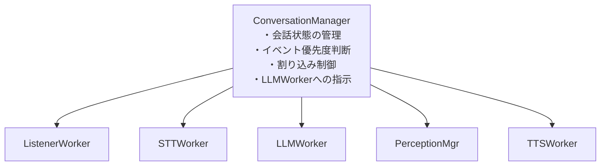
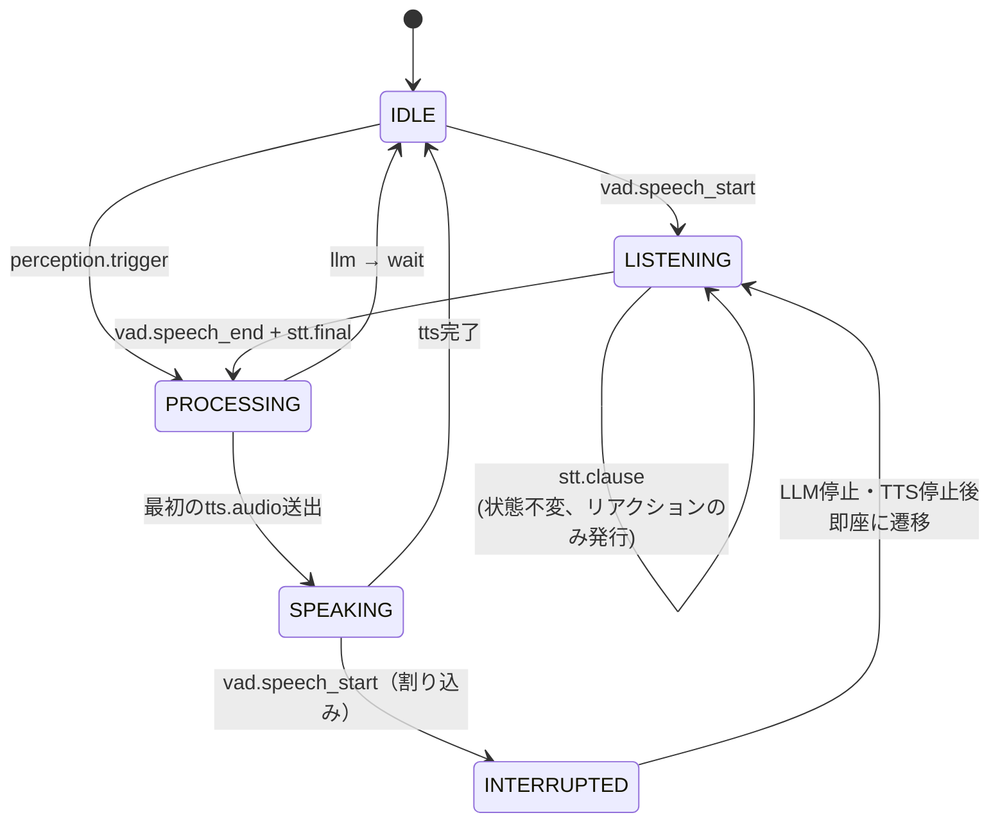
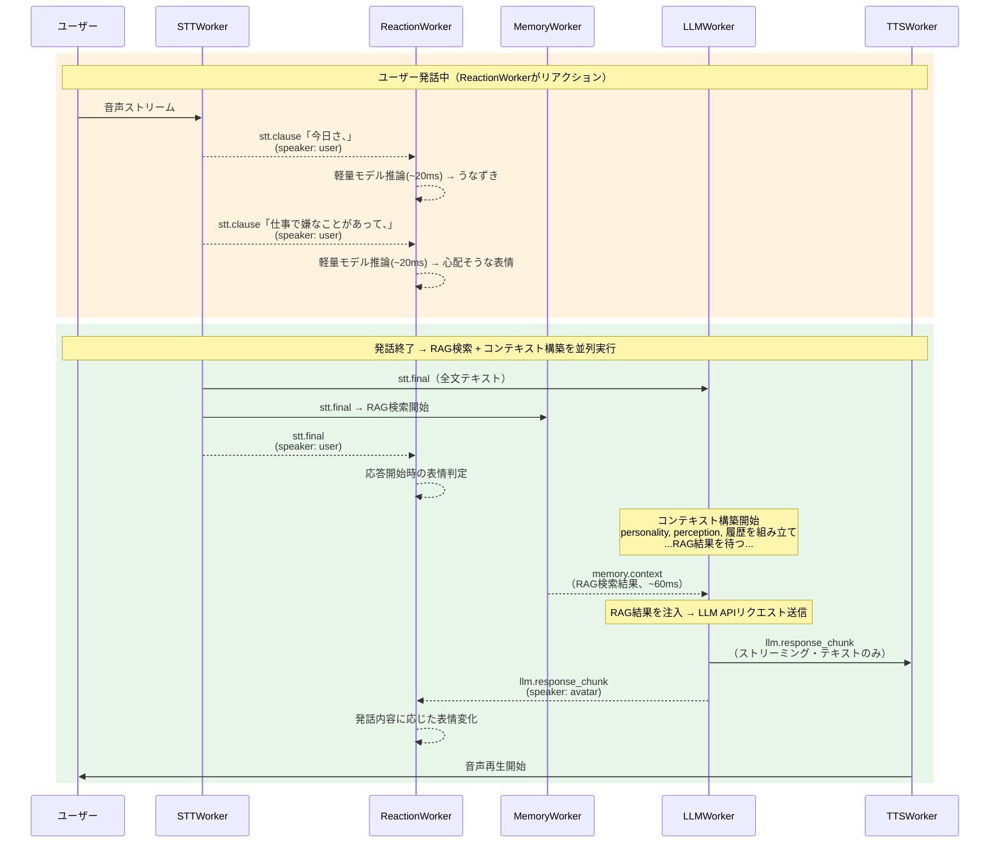
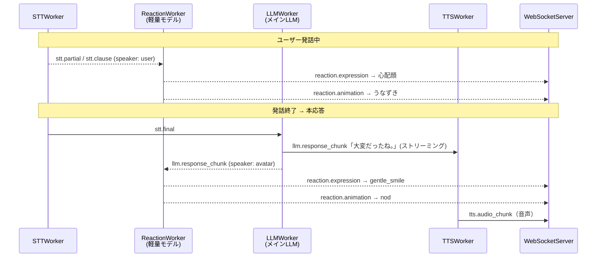
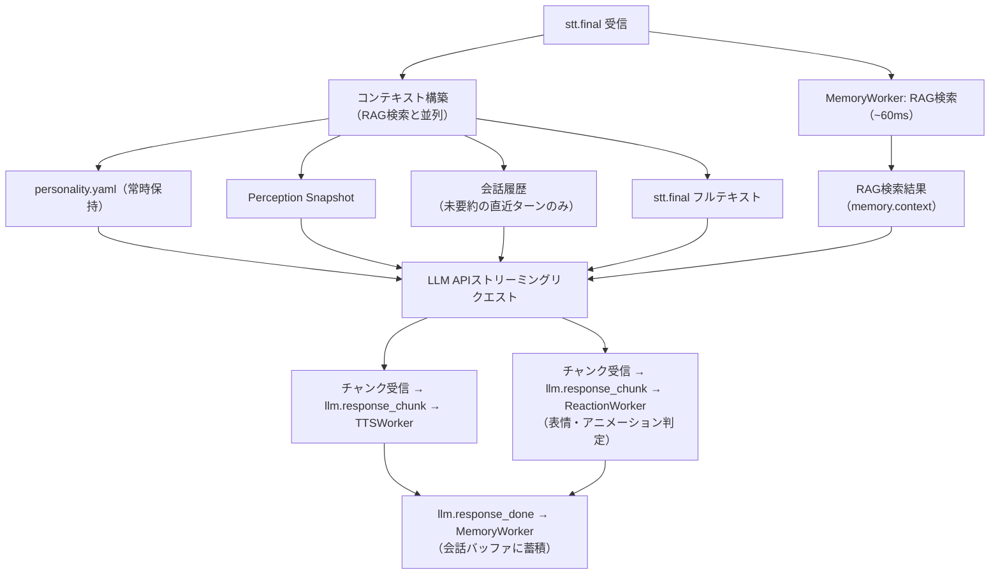
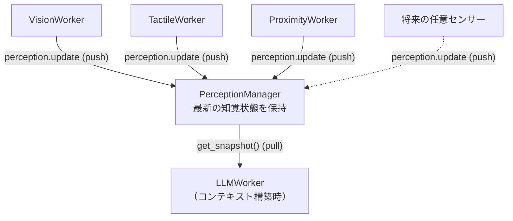
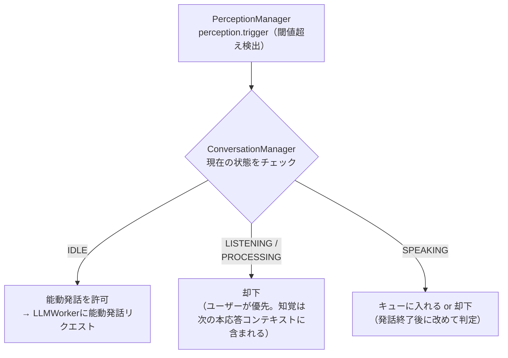
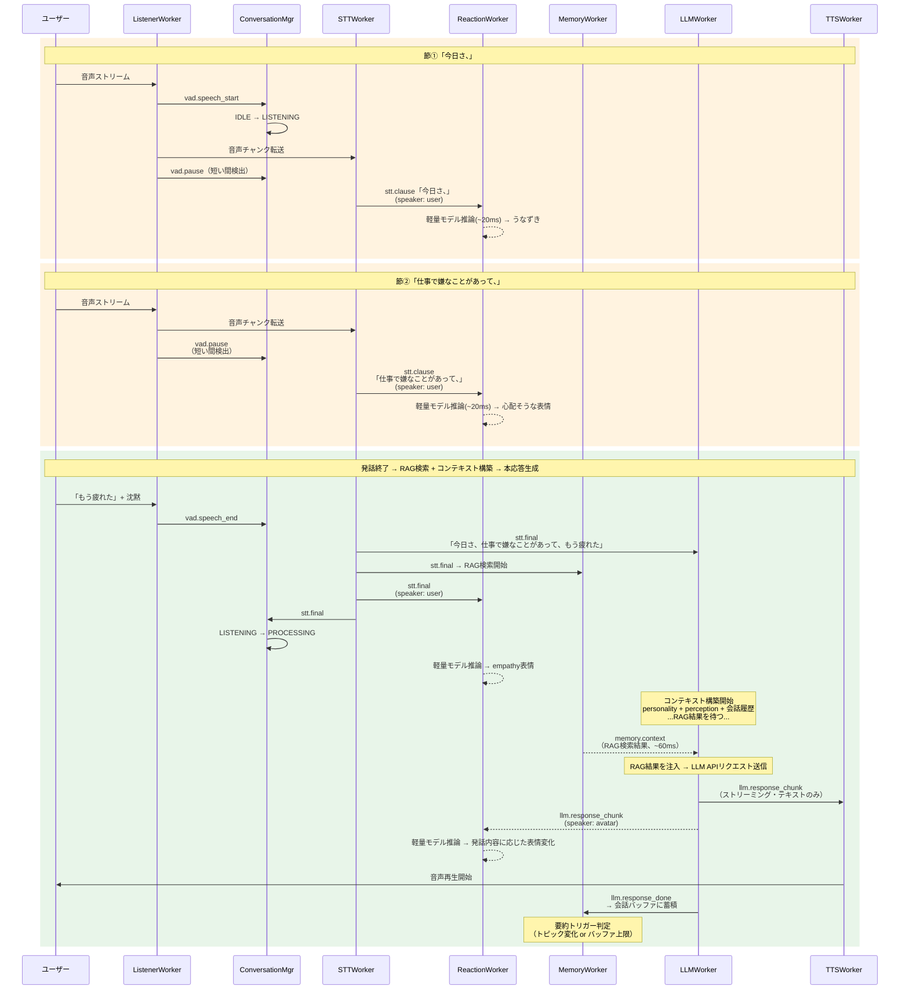

# 会話制御設計 - ターンテイキング・コンテキスト構築

## 概要

本ドキュメントはLLMWorkerを中心とした会話制御の詳細設計を記述する。
モデル非依存の基本ロジック（本ドキュメント）と、採用モデルごとのチューニング（別途）を明確に分離する。

### スコープ

**本ドキュメントの対象（モデル非依存の基本ロジック）:**
- コンテキスト構築戦略
- 会話フロー制御（ターンテイキング）
- 割り込み処理
- 知覚情報の統合
- イベント優先度
- レスポンスパース・バリデーション
- ストリーミング制御
- メモリ管理（会話履歴の保持・圧縮）

**別途定義するもの（モデル依存のチューニング）:**
- プロンプトテンプレートの最適化
- トークン上限・コンテキストウィンドウサイズの具体値
- API固有パラメータ（temperature, top_p, stop sequences等）
- レスポンス形式の強制方法（function calling vs JSON mode vs プロンプト指示）
- ストリーミングチャンクの粒度差異への対応

---

## ConversationManager

会話の状態管理とイベント優先度判断を専任するコンポーネント。
LLMWorkerに全責務を押し込むと肥大化するため、状態管理・優先度判断・割り込み制御を分離する。



### 会話状態マシン



状態一覧:
- `IDLE` - 待機中。誰も話していない
- `LISTENING` - ユーザーが発話中。アバターは聞いている
- `PROCESSING` - ユーザー発話終了、LLMが応答を生成中
- `SPEAKING` - アバターが発話中（TTS再生中）
- `INTERRUPTED` - 一時状態。割り込み検出後、LLM/TTSを停止しLISTENINGへ遷移

---

## ターンテイキング設計

### 設計方針: イベント駆動 + パイプライン並列化

固定間隔ポーリングではなく、**意味のある区切り（節区切り）をトリガーとする**方式を採用する。
固定間隔だと単語途中や不確定なSTT結果でLLMに送ることになり、判断精度が下がり、コストも無駄になる。

### 3つのトリガー層

| トリガー | 検出元 | 目的 | LLMへのリクエスト |
|---------|--------|------|-------------------|
| **節区切り** | STTの中間結果 + 句読点/間検出 | 先行処理の開始、リアクション | なし（ルールベース等で処理） |
| **VAD発話終了** | ListenerWorker | 本応答の生成 | フル（応答生成） |
| **割り込み検出** | ListenerWorker（SPEAKING中） | アバター発話の中断 | キャンセル + 新規リクエスト |

### 節区切り検出

以下のいずれかを節区切りとして検出する（STT/VAD併用を前提、実装時にチューニング）:

- STT中間結果に句読点（。、？！）が出現
- STT中間結果が更新されない期間が300-500ms続いた（短い間）
- STT中間結果のテキスト長が前回送信時から一定量増加

### パイプライン並列化

ユーザーが話している間にReactionWorkerがリアクションを生成し、発話終了後はRAG検索とコンテキスト構築を並列に進めて体感レイテンシを短縮する。



### ReactionWorker（表情・アニメーション専任）

表情・アニメーションの判定をLLMWorkerから完全に分離し、**ローカル軽量モデル（0.5B-1Bクラス）による専任Worker**とする。
ReactionWorkerはユーザー・アバター問わず流れてくるテキストを常時受け取り、リアルタイムに表情・アニメーションを決定する。

**分離の理由:**
- LLMWorkerはテキスト生成のみに専念でき、プロンプトがシンプルになる
- LLM応答フォーマットにemotionタグ等の制約を課す必要がなくなる
- ストリーミング応答からの構造化データ抽出（部分JSONパース等）が不要になる
- モデル選択の自由度が上がる（テキスト生成能力だけ求めればよい）

#### 入力ストリーム

ReactionWorkerは以下の全てのテキストイベントを購読し、同一パイプラインで処理する。
Phase分けや入力種別による処理分岐は行わない。

```
入力ストリーム（途切れなく流れてくる）:
  stt.partial  →  「今日さ、」                (speaker: user)
  stt.partial  →  「今日さ、仕事で」          (speaker: user)
  stt.clause   →  「今日さ、仕事で嫌なことがあって、」  (speaker: user)
  stt.final    →  「...もう疲れた」           (speaker: user)
  llm.response_chunk → 「大変だった」         (speaker: avatar)
  llm.response_chunk → 「大変だったね。」     (speaker: avatar)
  llm.response_chunk → 「ゆっくり休んだ方がいいよ。」  (speaker: avatar)
```

#### 入力データ構造

```python
@dataclass
class ReactionInput:
    text: str                  # テキスト断片
    speaker: "user" | "avatar" # 誰の発話か
```

speaker情報が必要な理由: ユーザーの「悲しい」に対するリアクション（共感）と、
自分が「大変だったね」と言っている時の表情（穏やかな微笑み）は異なるため。

#### 出力

```python
@dataclass
class ReactionResult:
    emotion: str              # "empathy", "joy", "neutral", ...
    animation: str | None     # "nod", "tilt_head", "lean_forward", None
    backchannel: str | None   # "うん", "へぇ", None（userの発話中のみ）
```

選択肢はBridge Capabilities（connection.helloで受信した表情・アニメーション一覧）から選択する。

#### 軽量モデルの選定方針

| 方式 | レイテンシ (GPU) | メリット | デメリット |
|------|-----------------|---------|-----------|
| ローカル軽量LLM (0.5B-1B) | 15-40ms | プロンプトでラベル体系を変更可能。avatar project毎のカスタマイズが容易 | GPU推奨 |
| fine-tuned distilBERT系 | 1-3ms | 超低レイテンシ。CPUでも高速 | ラベル変更時に再学習が必要 |

**推奨: ローカル軽量LLM**。avatar projectごとに表情・アニメーションのバリエーションが異なることを前提とすると、
プロンプトで制御できる方が拡張性が高い。

#### フロー全体像



### 本応答生成（stt.final時）

LLMWorkerは**テキスト生成のみ**を行う。感情・アニメーションの判定はReactionWorkerが担当する。



---

## 割り込み処理

### 方式: 猶予付き中断

ユーザー音声検出後、即座に中断するのではなく**300ms の猶予**を設ける。
猶予中にユーザー発話が継続している場合のみ中断を実行する。
これにより咳やノイズによる誤中断を防ぐ。猶予時間は設定可能とする。

### 中断処理フロー


### 割り込み関連イベント

| イベント | 発行元 | 購読先 | 目的 |
|---------|--------|--------|------|
| `turn.interrupt` | ConversationMgr | LLMWorker, TTSWorker | 現在の応答を中断 |
| `turn.cancel` | LLMWorker | TTSWorker | LLM応答ストリームの停止 |
| `tts.stop` | ConversationMgr | TTSWorker, WebSocketServer | 音声再生の即時停止 |

---

## PerceptionManager

全センサーの最新状態を集約・保持するコンポーネント。
各センサーWorkerが直接LLMWorkerにイベントを送る方式ではスケールしないため、
共有状態層を設けてLLMWorkerはコンテキスト構築時に最新状態をpullする。

### 設計パターン



音声パスはイベント駆動（push）、知覚パスは最新状態参照（pull）。この非対称性がポイント。

### インターフェース

```python
class PerceptionManager:
    def update(self, source: str, observation: PerceptionEntry) -> None:
        """各センサーWorkerが呼ぶ。最新の知覚を登録"""

    def get_snapshot(self) -> list[PerceptionEntry]:
        """LLMWorkerがコンテキスト構築時に呼ぶ。全センサーの最新状態を返す"""

    def get_snapshot_by_source(self, source: str) -> PerceptionEntry | None:
        """特定センサーの最新状態のみ取得"""
```

```python
@dataclass
class PerceptionEntry:
    source: str           # "vision", "tactile", ...
    text: str             # LLMコンテキストに注入するテキスト表現
    timestamp: float      # 観測時刻
    priority: int         # コンテキストのトークン配分時の優先度
    ttl: float            # 有効期限（秒）。古い知覚は自動的に無視
```

### TTL（有効期限）

センサーごとに知覚の鮮度が異なる。ttl切れの知覚はget_snapshot()の結果に含まれない。

| センサー | ttl目安 | 理由 |
|---------|---------|------|
| 視覚 | 10-30秒 | シーンは比較的ゆっくり変化 |
| 触覚 | 3-5秒 | 接触は瞬間的、すぐ陳腐化 |
| 距離 | 5-10秒 | 人の移動速度に依存 |
| 温度 | 60秒 | ゆっくり変化 |

### 新しいセンサーの追加手順

1. 新しいWorkerを作る（例: `TactileWorker`）
2. そのWorkerが `perception.update` イベントを発行する
3. 以上。LLMWorkerの修正は不要。

### 知覚がターンを駆動するケース（能動発話）

コンテキスト提供型の知覚でも、閾値を超えた場合にアバター側から能動的に発話を開始するケースがある。

例:
- ユーザーが近づいてきた → 「あ、こんにちは」
- 突然触られた → 「わっ、びっくりした」
- ユーザーが離れていく → 「あれ、行っちゃうの？」



能動発話の制御パラメータ（personality.yaml に設定）:

```yaml
proactive_speech:
  enabled: true
  cooldown_seconds: 30     # 能動発話後、次の能動発話まで最低30秒空ける
  max_per_minute: 2        # 1分間に最大2回まで
  priority_threshold: 3    # この優先度以上の知覚トリガーのみ能動発話を許可
```

---

## イベント優先度

ConversationManagerが判断する優先度体系。

```
優先度1（最高）: ユーザー割り込み
  vad.speech_start（SPEAKING中）
  → 他の全てを中断してでもユーザーの発話を聞く

優先度2: ユーザー通常発話
  stt.final → 本応答生成
  → 知覚トリガーより優先

優先度3: 高優先度の知覚トリガー
  例: 突然触られた、ユーザーが目の前に来た
  → IDLE時のみ能動発話を開始

優先度4: 低優先度の知覚トリガー
  例: 背景の変化、温度変化
  → 能動発話はしない。次の本応答コンテキストに含めるのみ

優先度5（最低）: リアクション
  stt.clause → 相槌・表情
  → いつでも実行可能、他を中断しない
```

---

## コンテキスト構築

コンテキスト構造・トークン配分の優先度ルールはモデル依存のチューニングに該当するため、
[llm-prompt-design.md](llm-prompt-design.md) に記述する。

### 会話履歴とRAG記憶の関係

MemoryWorkerが会話バッファを要約してベクトルDBに保存すると、要約済みターンはコンテキストの会話履歴から削除される。
これにより、会話履歴には常に**未要約の直近ターンのみ**が含まれる。

```
コンテキスト内の会話履歴:
┌─────────────────────────────────────┐
│ [直近の未要約ターンのみ]              │
│ User: 「もう疲れた」                 │  ← 直近は原文保持
│ Avatar: 「大変だったね（中断）」      │     中断情報も含む
│ User: 「ちょっと待って、電話が...」   │     最大max_buffer_turnsターン
└─────────────────────────────────────┘

過去の会話はRAG検索でヒットした場合のみ RAG Resultsとして注入:
┌─────────────────────────────────────┐
│ [RAG検索結果]                        │
│ 「2025-12-15: ユーザーは車を         │  ← 関連する過去の要約のみ
│  買い替えた話をした。新車はフィット。」 │
└─────────────────────────────────────┘
```

### 要約トリガー

MemoryWorkerは以下のOR条件で要約・保存を実行する。本応答とは非同期に実行される。

| 条件 | タイミング | 説明 |
|------|-----------|------|
| トピック変化検出 | `llm.response_done` 受信時 | 軽量LLMで前回要約と現在バッファを比較し判定 |
| バッファ上限到達 | `llm.response_done` 受信時 | `max_buffer_turns`（設定値）に達したら強制実行 |
| セッション終了 | Engine停止時 | 残りバッファを要約・保存 |

要約フロー:
```
バッファ内の会話ターン
  → 軽量LLMで要約テキスト生成
  → RAGEngine経由でEmbedding化 + ベクトルDB保存
  → 要約済みターンをコンテキストの会話履歴から削除
```

---

## LLMレスポンス

LLMWorkerはプレーンテキストのみを返す。感情・アニメーション関連のフィールドは含まない。

| action | 用途 | トリガー |
|--------|------|---------|
| `respond` | 本応答（テキストのみ） | VAD発話終了後のstt.final |
| `wait` | まだ聞いている（応答しない） | VAD発話終了（でもまだ続きそうと判断） |

※ `backchannel` / `interrupt` はReactionWorkerの責務。LLMWorkerのactionからは除外。

### Wait蓄積ロジック

話速が遅い・「えーと」などの間投詞によりVADが途中で `stt.final` を発行するケースがある。
このとき `wait` を返したLLMは次の発話を待つが、その間にConversationManagerは断片テキストを蓄積する必要がある。

**責務: ConversationManager が `pending_utterance` バッファを管理する。**

```
stt.final「えーと...」       → LLM: wait → バッファ = 「えーと...」
  （ユーザーが再び話し始める: VAD speech_start → LISTENING → speech_end）
stt.final「今日仕事で...」   → LLM: wait → バッファ = 「えーと... 今日仕事で...」
  （同上）
stt.final「嫌なことがあった」→ LLM: respond → バッファをクリア
  → 会話履歴に1ターンとして記録:
     User: 「えーと... 今日仕事で... 嫌なことがあった」
```

**バッファのライフサイクル:**

| タイミング | 操作 |
|-----------|------|
| `wait` 返却時 | バッファ末尾に現在の `stt.final` テキストを追記 |
| 次の `stt.final` 送信時 | バッファ + 新テキストをまとめてLLMに送る |
| `respond` 返却時 | バッファ全体を1ターンとして会話履歴に記録後、クリア |
| `turn.interrupt` 発生時 | バッファをクリア（割り込みで会話リセット） |
| wait後に一定時間（`wait_timeout`秒）新たな発話がない場合 | バッファを強制 `respond` 扱いにしてLLMへ再送 |

`wait_timeout` はデフォルト10秒程度を想定。personality.yaml に設定可能とする。

**状態遷移との関係:**

既存の `PROCESSING → IDLE（llm: wait）` 遷移はそのまま使用する。
IDLEへの遷移後、ユーザーが再び話し始めると通常のVADフローで `IDLE → LISTENING → PROCESSING` に戻る。
バッファが非空のとき ConversationManager はそれを「続きの発話」として扱う。

---

## Worker間イベントフロー全体像



