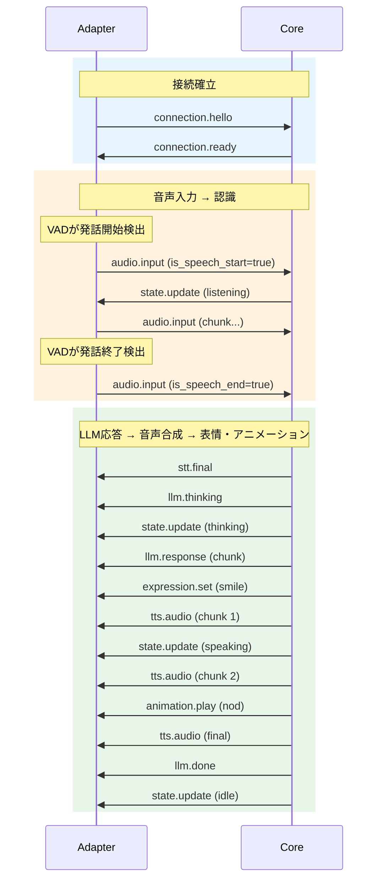
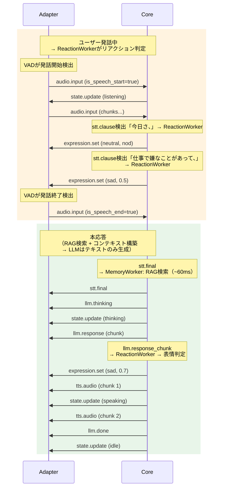
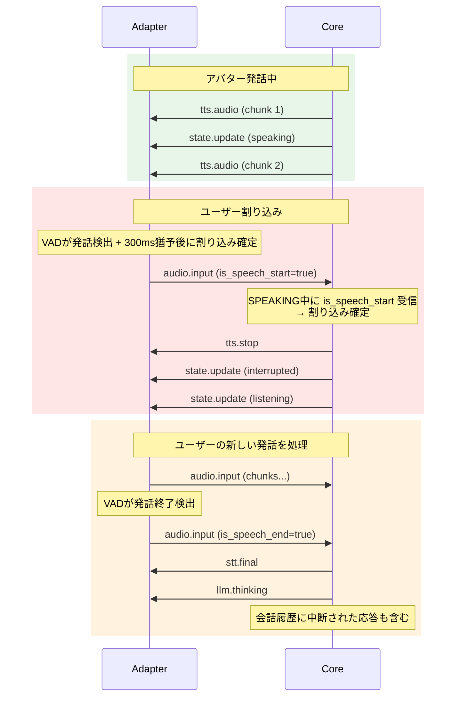

# WebSocket メッセージプロトコル仕様

## 概要

Python Core（脳）と Unity/ROS2 Adapter（身体）間の通信プロトコル。
WebSocket上でJSONメッセージをやり取りする。

## 接続

- プロトコル: WebSocket (ws://)
- デフォルトポート: 8765
- メッセージ形式: JSON (UTF-8)
- 音声データ: Base64エンコードしてJSON内に格納（初期実装）

## メッセージ共通フォーマット

```json
{
  "type": "カテゴリ.アクション",
  "timestamp": 1234567890.123,
  "payload": { ... }
}
```

| フィールド | 型 | 説明 |
|-----------|-----|------|
| type | string | メッセージ種別（`カテゴリ.アクション` 形式） |
| timestamp | float | Unixタイムスタンプ（秒、ミリ秒精度） |
| payload | object | メッセージ固有のデータ |

## メッセージ方向

```
Adapter → Core:  入力系（音声、カメラ映像、ユーザー操作）
Core → Adapter:  出力系（音声合成、表情、アニメーション、状態）
双方向:          接続管理、同期
```

## メッセージ一覧

### 接続管理

#### `connection.hello` (Adapter → Core)

接続時にAdapterが送信。アバターの能力を通知。
3Dモデルごとに使える表情やアニメーションが異なるため、Adapter側が自身の能力を自己申告する。
Core側はこの情報をLLMのコンテキストに注入し、モデルごとの差異を吸収する。

```json
{
  "type": "connection.hello",
  "timestamp": 1234567890.123,
  "payload": {
    "adapter_type": "unity",
    "capabilities": ["audio_input", "audio_output", "expression", "animation", "vision"],
    "expressions": {
      "smile":     { "supports_intensity": true },
      "angry":     { "supports_intensity": true },
      "sad":       { "supports_intensity": true },
      "surprised": { "supports_intensity": true },
      "neutral":   { "supports_intensity": true }
    },
    "animations": {
      "idle":       { "supports_speed": true, "supports_loop": true },
      "nod":        { "supports_speed": true, "supports_loop": false },
      "shake_head": { "supports_speed": true, "supports_loop": false },
      "wave":       { "supports_speed": true, "supports_loop": false },
      "think":      { "supports_speed": true, "supports_loop": false }
    }
  }
}
```

#### `connection.ready` (Core → Adapter)

Coreの準備完了を通知。

```json
{
  "type": "connection.ready",
  "timestamp": 1234567890.123,
  "payload": {
    "session_id": "uuid-string"
  }
}
```

#### `connection.disconnected` (内部イベント、Core内部のみ)

WebSocket接続が切断されたことをEngineが検知し、EventBusに流す内部イベント。AdapterからのJSONメッセージではない。
MemoryWorkerがこのイベントを購読し、残存する会話バッファの要約・保存を実行してセッションを終了する。

### 音声入力 (Adapter → Core)

#### `audio.input`

Adapter側のVADで発話区間と判定された音声チャンク。**発話区間のみ送信**し、無音区間は送信しない。

```json
{
  "type": "audio.input",
  "timestamp": 1234567890.123,
  "payload": {
    "data": "base64-encoded-audio-chunk",
    "format": "pcm_16bit",
    "sample_rate": 16000,
    "channels": 1,
    "is_speech_start": true,
    "is_speech_end": false
  }
}
```

| フラグ | 省略時 | 説明 |
|-------|-------|------|
| `is_speech_start` | false | 発話区間の最初のチャンク。CoreのConversationManagerが割り込み検出に使用 |
| `is_speech_end` | false | 発話区間の最後のチャンク。一括変換型STT（Whisper等）の変換トリガー |

> VAD（発話区間検出）はAdapter側の責務。詳細は `stt-processing-design.md` を参照。

### 音声認識 (Core → Adapter)

#### `stt.partial`

音声認識の中間結果。UIに表示用。

> **注**: ストリーミング対応STTエンジン（Google STT等）でのみ発行される。
> 一括変換型エンジン（Whisper等）ではこのメッセージは送信されない。

```json
{
  "type": "stt.partial",
  "timestamp": 1234567890.123,
  "payload": {
    "text": "今日の天気は",
    "is_final": false
  }
}
```

#### `stt.final`

音声認識の確定結果。

```json
{
  "type": "stt.final",
  "timestamp": 1234567890.123,
  "payload": {
    "text": "今日の天気はどうですか？",
    "is_final": true
  }
}
```

### LLM応答 (Core → Adapter)

#### `llm.thinking`

LLMが思考中であることを通知。

```json
{
  "type": "llm.thinking",
  "timestamp": 1234567890.123,
  "payload": {}
}
```

#### `llm.response`

LLMのストリーミング応答。テキストチャンク単位で送信。

```json
{
  "type": "llm.response",
  "timestamp": 1234567890.123,
  "payload": {
    "chunk": "今日は",
    "is_final": false
  }
}
```

#### `llm.done`

LLM応答完了。

```json
{
  "type": "llm.done",
  "timestamp": 1234567890.123,
  "payload": {
    "full_text": "今日はいい天気ですね。散歩に行きませんか？"
  }
}
```

### 音声合成 (Core → Adapter)

#### `tts.audio`

合成音声データ。文単位でチャンク送信。

> **注**: ストリーミングの粒度はTTSエンジンに依存する。VOICEVOX等の一括合成型エンジンでは、
> LLM応答を句点区切り等で分割し、文単位で合成・送信する方式をとる。

```json
{
  "type": "tts.audio",
  "timestamp": 1234567890.123,
  "payload": {
    "data": "base64-encoded-audio-chunk",
    "format": "pcm_16bit",
    "sample_rate": 24000,
    "channels": 1,
    "is_final": false
  }
}
```

### 表情制御 (Core → Adapter)

#### `expression.set`

表情の設定。Adapterは自身のIExpressionHandler実装で3Dモデルに反映。

```json
{
  "type": "expression.set",
  "timestamp": 1234567890.123,
  "payload": {
    "emotion": "smile",
    "intensity": 0.8,
    "transition_ms": 300
  }
}
```

### アニメーション制御 (Core → Adapter)

#### `animation.play`

アニメーションの再生指示。

```json
{
  "type": "animation.play",
  "timestamp": 1234567890.123,
  "payload": {
    "name": "nod",
    "speed": 1.0,
    "loop": false
  }
}
```

### 視覚入力 (Adapter → Core)

#### `vision.frame`

カメラ映像フレーム。一定間隔（例: 1fps）で送信。

```json
{
  "type": "vision.frame",
  "timestamp": 1234567890.123,
  "payload": {
    "data": "base64-encoded-jpeg",
    "width": 640,
    "height": 480,
    "format": "jpeg"
  }
}
```

### 状態通知 (Core → Adapter)

#### `state.update`

会話状態の変化を通知。

```json
{
  "type": "state.update",
  "timestamp": 1234567890.123,
  "payload": {
    "conversation_state": "listening"
  }
}
```

conversation_state の値:
- `idle` - 待機中
- `listening` - 聞いている
- `thinking` - 考えている
- `speaking` - 話している
- `interrupted` - 割り込みにより中断（一時的、すぐにlisteningへ遷移）

### 割り込み制御 (Core → Adapter)

#### `tts.stop`

アバター発話の即時停止指示。ユーザー割り込み検出時に送信。

```json
{
  "type": "tts.stop",
  "timestamp": 1234567890.123,
  "payload": {}
}
```

Adapter側は再生中の音声を即座に停止し、バッファをクリアする。

## フロー例：基本的な会話



## フロー例：リアクション付き会話（パイプライン並列化）



## フロー例：ユーザー割り込み


